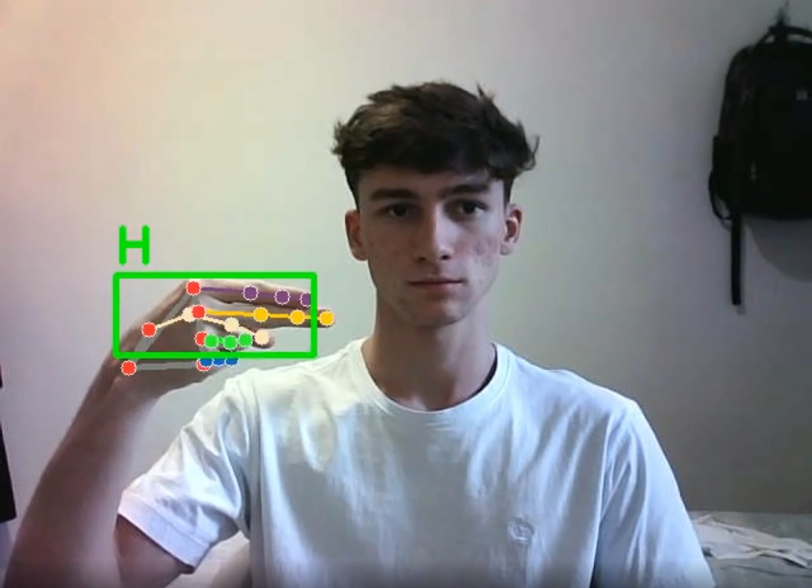

# Reconhecimento de Libras com visão computacional

Este projeto tem como objetivo identificar linguagem de sianais utilizando técnicas de visão computacional e machine learning. Todo o pipeline, desde a coleta de dados até a inferência em tempo real, foi desenvolvido do zero.

Vídeo no meu linkedin testando o modelo: [Vídeo](https://www.linkedin.com/posts/joao-emanuel-7bb2981a4_projeto-de-vis%C3%A3o-computacional-com-linguagem-activity-7345904031329845248-s-o2?utm_source=share&utm_medium=member_desktop&rcm=ACoAAC-9a38B_ih9uTXawvKzjklse66Jn0wYGio)

## Tecnologias utilizadas

- Python
- OpenCV — Para captura e processamento de vídeo.
- MediaPipe — Para detecção de landmarks da mão.
- Scikit-learn — Para treinamento do modelo.
- Pickle — Para salvar o dataset e o modelo treinado.

## Coleta de dados

Utilizei a webcam com OpenCV para capturar imagens de cada gesto em Libras. Os dados foram organizados em pastas por classe e anotados com os landmarks das mãos usando o MediaPipe.

## Treinamento

Após a coleta:
- Extraí os pontos chave de cada mão.
- Modelei um classificador com RandomForestClassifier do scikit-learn.
- Avaliei o desempenho com acurácia em conjunto de teste.

## Salvamento do modelo

O modelo treinado foi salvo com a biblioteca pickle para ser reutilizado posteriormente em aplicações de inferência.

## Inferência em tempo real

Criei um script (inference_classifier.py) que:
- Ativa a webcam.
- Usa o MediaPipe para detectar a mão.
- Extrai os landmarks.
- Classifica o gesto (A cada 20 frames) com o modelo treinado.

## Resultados

- Modelo: Random Forest
- Acurácia: 99%
